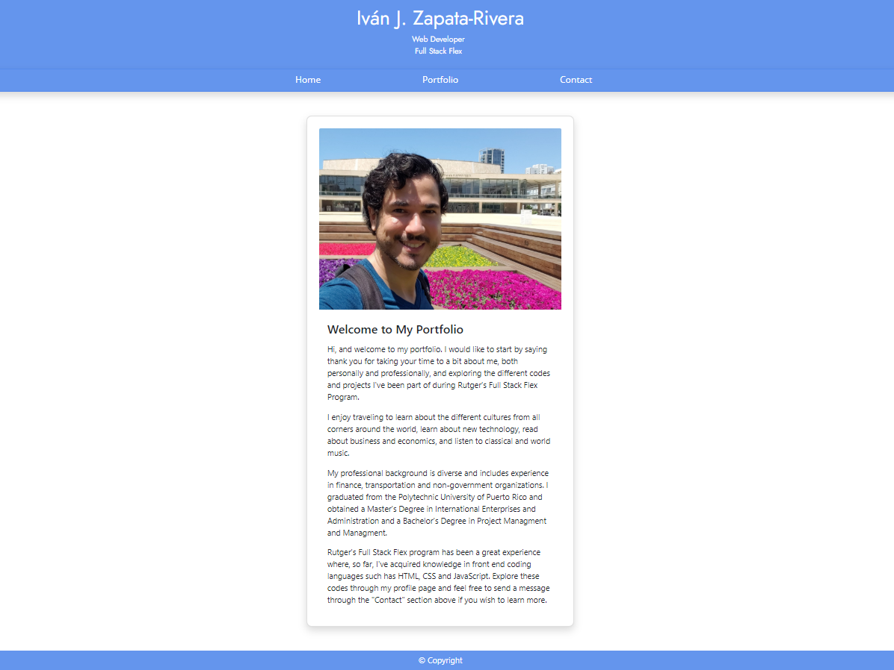

# Updated Portfolio

## Welcome to my Portfolio! 

Here you will be able to find the latest coding work that I've performed during Rutger's Coding Bootcamp. So far, there have been four assignments that I've completed: 

* Code Refactor
* Original Portfolio
* Password Generator
* Code Quiz
* Day Planner
* Weather Widget

Each one of these codes presents it's own unique challenge in HTML, CSS and JavaScript. You're welcome to navigate through this page and view my codes.

## Links to GitHub Page and Repository

Use the links below to access this updated portfolio:

* URL: https://johnsbrook.github.io/Portfolio_Updated
* GitHub Repository: https://github.com/johnsbrook/Portfolio_Updated 

Either, click on the link above to open on the computer or mobile device's default browser or copy and paste on the preferred browser. 

